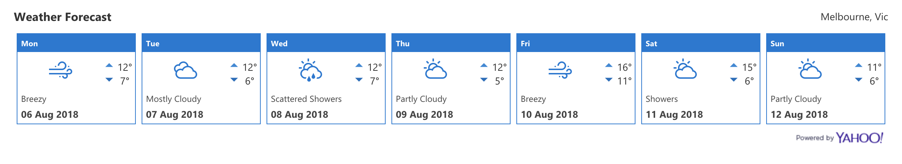

# SPFX Weather Widget

This is a simple weather forecast widget written using the SPFX framework and yahoo weather API.


>Screenshot of widget with default colours

## Installation

You can install the web part using the pre-packaged solution (which I will endeavour to keep up to date) found here: 'sharepoint/solution/weather.sppkg'

Alternatively you can build your own copy by cloning this repository and running the following commands:

``` bash
gulp bundle --ship
gulp package-solution --ship
```

Then upload the new sppkg file from the sharepoint folder.

## Configuration

The config pane gives you the option to customise the city for which to show the forecast.

The widget will respect the current theme colours being used on your SharePoint site.